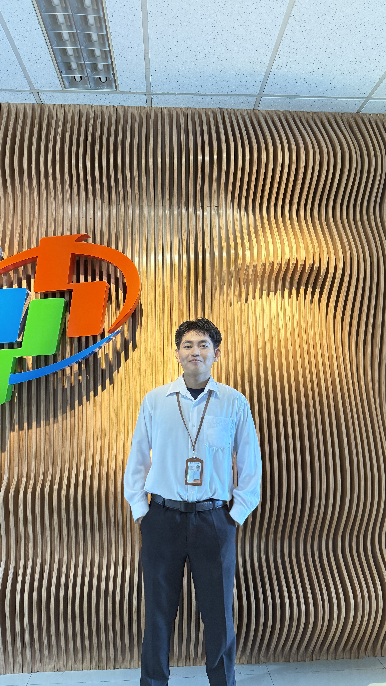

<div align="center">
  
  
  # 🌌 Cosmic Portfolio | Ikhsanuddin Rezki
  
  *Sistem navigasi masa depan, estetika sinematik, dan performa tanpa kompromi.*
  
  [](https://vercel.com/)
  [](https://github.com/Rexzkyyy/Kyy_Porto/blob/main/LICENSE)
  [](https://reactjs.org/)
  [](https://supabase.com/)

  [Demo Live](#) • [Lapor Bug](https://github.com/Rexzkyyy/Kyy_Porto/issues) • [Kontak Pengembang](mailto:ikhsanuddin.rz@gmail.com)
</div>

---

## ✨ Tentang Proyek Ini

Ini bukan sekadar portofolio biasa. Ini adalah **Cosmic Portfolio** — sebuah platform showcase digital yang dirancang untuk memberikan pengalaman naratif yang mendalam. Dengan latar belakang *dark matter*, efek *glassmorphism*, dan transisi antar bagian yang sangat halus, proyek ini mencerminkan dedikasi saya terhadap detail dan kualitas.

### 🌟 Mengapa Proyek Ini Spesial?
- **🎯 60 FPS Engine**: Animasi yang dioptimalkan menggunakan GSAP dan Lenis untuk scrolling yang sehalus sutra.
- **🛡️ Dynamic Dashboard**: Panel admin rahasia (lazy-loaded) untuk memperbarui konten tanpa mengubah kode.
- **💎 Premium UI**: Menggunakan Palet warna yang dikurasi (Indigo, Purple, Slate) untuk kesan mewah dan profesional.
- **⚡ Supercharged by Vite**: Build tercepat dengan optimasi chunking untuk waktu muat yang instan.

---

## 🛠️ Tech Stack

<details>
<summary><b>Klik untuk melihat detail teknologi</b></summary>

- **Core**: [React 19](https://reactjs.org/), [TypeScript](https://www.typescriptlang.org/)
- **Animation**: [GSAP](https://gsap.com/), [Framer Motion](https://www.framer.com/motion/), [Typed.js](https://mattboldt.github.io/typed.js/)
- **Backend**: [Supabase](https://supabase.com/) (PostgreSQL + Authentication)
- **Styling**: [Tailwind CSS](https://tailwindcss.com/)
- **Others**: Lenis (Smooth Scroll), Lucide Icons, React-TSParticles, Vite

</details>

---

## 📸 Preview Visual

| Section Hero | Dashboard Admin |
| :---: | :---: |
|  |  |

> *Catatan: Gambar di atas adalah representasi visual utama dari aset proyek.*

---

## ⚙️ Cara Setup & Instalasi

### 1️⃣ Clone & Install
```bash
git clone https://github.com/Rexzkyyy/Kyy_Porto.git
cd porto-app
npm install
```

### 2️⃣ Environment Configuration
Buat file `.env` di root folder:
```env
VITE_SUPABASE_URL=your_supabase_url
VITE_SUPABASE_ANON_KEY=your_supabase_key
```

### 3️⃣ Development Mode
```bash
npm run dev
```

---

## 🚀 Deployment ke Vercel

Dibuat khusus untuk ekosistem Vercel:
1. Fork/Push repository ini.
2. Di Vercel, pilih **Add New Project**.
3. Pastikan memasukkan **Environment Variables** di atas.
4. Klik **Deploy**. Selesai!

---

<div align="center">
  <p>Dikembangkan dengan ❤️ untuk masa depan teknologi.</p>
  <b>Ikhsanuddin Rezki © 2026</b>
</div>
